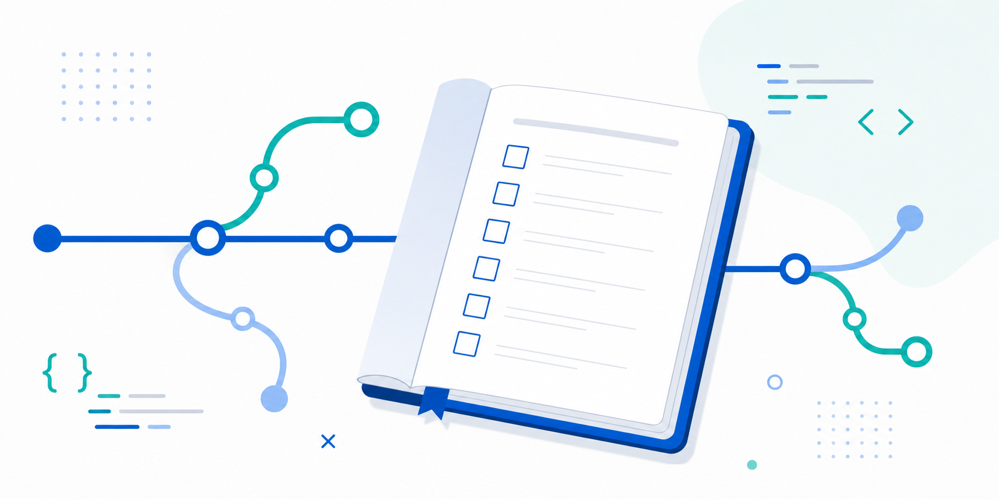

# Open World Checklist

Open World Checklist is a small, beginner-friendly static web tool for learning Git and GitHub through real, observable changes. It turns foundational workflow steps into a checklist that can be explored in a browser.

The project intentionally keeps its technology simple: HTML, CSS, JavaScript, and JSON data. That makes each commit, diff, branch, pull request, and automated check easy to inspect while still producing a useful page.

## What it does

The checklist loads learning tasks from `data/tasks.json`, displays their category, and lets each visitor keep completion choices in their own browser.

## Verification

Run `python3 scripts/validate_tasks.py data/tasks.json`, `python3 -m unittest tests/test_validate_tasks.py`, and `python3 scripts/check_links.py`.

## Contributing and license

Read [CONTRIBUTING.md](CONTRIBUTING.md) before opening a pull request. This project is available under the [MIT License](LICENSE).

## Quick preview

Run `python3 -m http.server 8000` from the repository root, then open `http://localhost:8000` in a browser.
